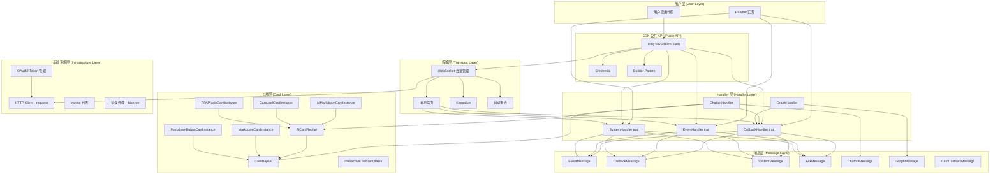

# 整体架构图

```mermaid
graph TB
    subgraph "用户层 (User Layer)"
        U1[用户应用代码]
        U2[Handler 实现]
    end

    subgraph "SDK 公共 API (Public API)"
        A1[DingTalkStreamClient]
        A2[Credential]
        A3[Builder Pattern]
    end

    subgraph "Handler 层 (Handler Layer)"
        H1[CallbackHandler trait]
        H2[EventHandler trait]
        H3[SystemHandler trait]
        H4[ChatbotHandler]
        H5[GraphHandler]
    end

    subgraph "消息层 (Message Layer)"
        M1[EventMessage]
        M2[CallbackMessage]
        M3[SystemMessage]
        M4[AckMessage]
        M5[ChatbotMessage]
        M6[GraphMessage]
        M7[CardCallbackMessage]
    end

    subgraph "卡片层 (Card Layer)"
        C1[CardReplier]
        C2[AICardReplier]
        C3[MarkdownCardInstance]
        C4[AIMarkdownCardInstance]
        C5[MarkdownButtonCardInstance]
        C6[CarouselCardInstance]
        C7[RPAPluginCardInstance]
        C8[InteractiveCardTemplates]
    end

    subgraph "传输层 (Transport Layer)"
        T1[WebSocket 连接管理]
        T2[消息路由]
        T3[Keepalive]
        T4[自动重连]
    end

    subgraph "基础设施层 (Infrastructure Layer)"
        I1[HTTP Client - reqwest]
        I2[OAuth2 Token 管理]
        I3[tracing 日志]
        I4[错误处理 - thiserror]
    end

    U1 --> A1
    U2 --> H1 & H2 & H3
    A1 --> A2 & A3
    A1 --> H1 & H2 & H3
    H4 --> H1
    H5 --> H1
    H1 & H2 & H3 --> M1 & M2 & M3 & M4
    H4 --> M5
    H5 --> M6
    H4 --> C1 & C2
    C2 --> C1
    C3 & C5 --> C1
    C4 & C6 & C7 --> C2
    T1 --> T2 --> H1 & H2 & H3
    T1 --> T3 & T4
    T1 --> I1
    I2 --> I1
    A1 --> T1
```
