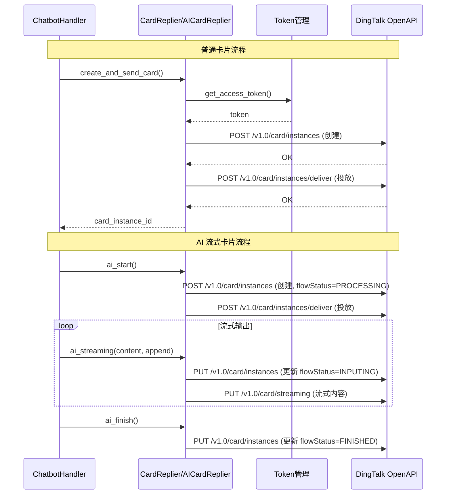

# 卡片操作时序图

```mermaid
sequenceDiagram
    participant Handler as ChatbotHandler
    participant Card as CardReplier/AICardReplier
    participant Auth as Token管理
    participant API as DingTalk OpenAPI

    Note over Handler,API: 普通卡片流程
    Handler->>Card: create_and_send_card()
    Card->>Auth: get_access_token()
    Auth-->>Card: token
    Card->>API: POST /v1.0/card/instances (创建)
    API-->>Card: OK
    Card->>API: POST /v1.0/card/instances/deliver (投放)
    API-->>Card: OK
    Card-->>Handler: card_instance_id

    Note over Handler,API: AI 流式卡片流程
    Handler->>Card: ai_start()
    Card->>API: POST /v1.0/card/instances (创建, flowStatus=PROCESSING)
    Card->>API: POST /v1.0/card/instances/deliver (投放)

    loop 流式输出
        Handler->>Card: ai_streaming(content, append)
        Card->>API: PUT /v1.0/card/instances (更新 flowStatus=INPUTING)
        Card->>API: PUT /v1.0/card/streaming (流式内容)
    end

    Handler->>Card: ai_finish()
    Card->>API: PUT /v1.0/card/instances (更新 flowStatus=FINISHED)
```
