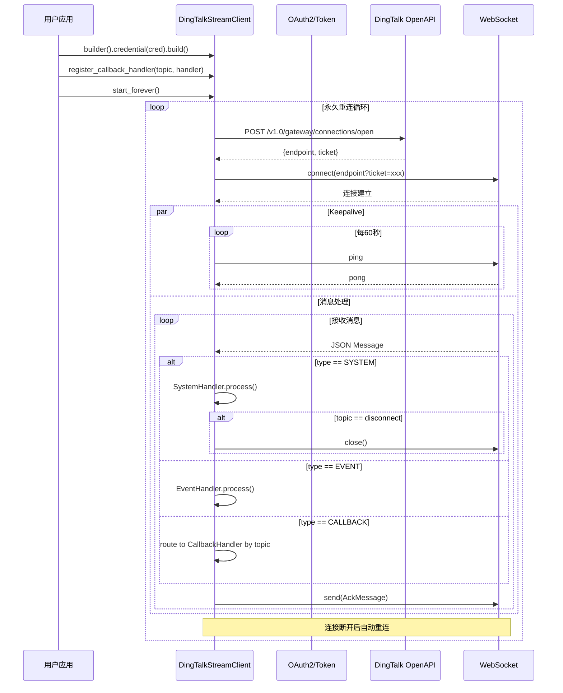

# 连接生命周期时序图

```mermaid
sequenceDiagram
    participant App as 用户应用
    participant Client as DingTalkStreamClient
    participant Auth as OAuth2/Token
    participant API as DingTalk OpenAPI
    participant WS as WebSocket

    App->>Client: builder().credential(cred).build()
    App->>Client: register_callback_handler(topic, handler)
    App->>Client: start_forever()

    loop 永久重连循环
        Client->>API: POST /v1.0/gateway/connections/open
        API-->>Client: {endpoint, ticket}
        Client->>WS: connect(endpoint?ticket=xxx)
        WS-->>Client: 连接建立

        par Keepalive
            loop 每60秒
                Client->>WS: ping
                WS-->>Client: pong
            end
        and 消息处理
            loop 接收消息
                WS-->>Client: JSON Message
                alt type == SYSTEM
                    Client->>Client: SystemHandler.process()
                    alt topic == disconnect
                        Client->>WS: close()
                    end
                else type == EVENT
                    Client->>Client: EventHandler.process()
                else type == CALLBACK
                    Client->>Client: route to CallbackHandler by topic
                end
                Client->>WS: send(AckMessage)
            end
        end

        Note over Client,WS: 连接断开后自动重连
    end
```
